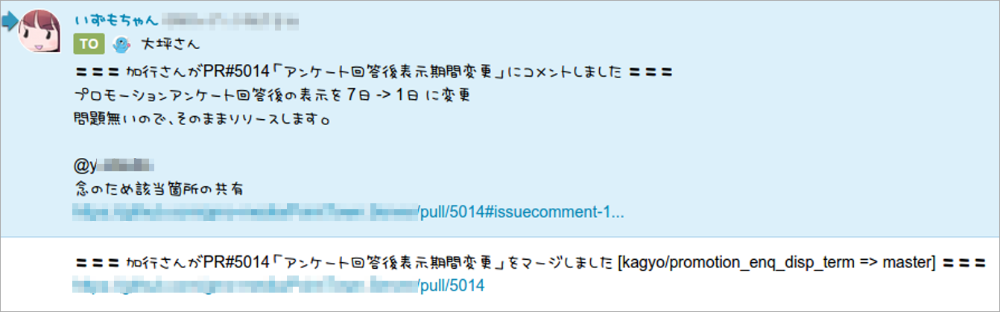
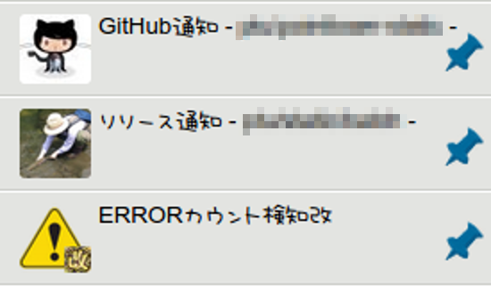

class: center, middle, inverse
name: inverse

# ChatWorkが大好きなので<br/>どうしても伝えたい３つのこと

.footnote[マネーフォワード LT会 2015/9/30]

---

# こんにちは！

- .large[あさい]です
- Twitter: @hito_asa
- 5年前はScala書いてました
- 最近は__Struts1.x__とか__Seasar2__のプロジェクトのお手伝いをしています

---


---

class: center, middle, inverse

# Strutsが大好きです！

---

class: center, middle, inverse

# 間違えました

---

class: center, middle, inverse

# .large[ChatWorkが大好きです！]

---

class: largecode

# お手軽なAPI

```
curl -X POST \
     -H "X-ChatWorkToken:XXX" \
     -d body="hello" \
     https://api.chatwork.com/v1/rooms/123456/messages
```
<br/>
<br/>


---

# 進捗どうですか？


---

# 柔軟なメッセージフォーマット

　　


---

# 深夜でも遠慮なく<br/>mentionを送れる機能


---

class: center, middle, inverse

# すばらしいですね！

---

# .small[でもintegration機能がありません]


---

class: center, middle, inverse

# だからどうした！

---

class: center, middle, inverse

# 自分で作ればいいじゃないか！

---

# 通知職人はじめました

- GitHub通知
- デプロイ通知
- エラー通知
- Qiita:Team通知

...など

---

class: center, middle, inverse

# 伝わる通知を作る

---

# 一瞬で伝わる通知にする

- 余分な情報を削ぎ落とす（大事）
- 文章にする
- 通知の種類で抑揚をつける

---

# 伝わらない通知の例


- 「プルリクをマージした」のがわかりにくい
- コミットIDとか"pushed to branch"とか<br/>余分な情報が多い

---

# 伝わらない通知の例


- クローズしたのかマージしたのかわからない
- このプルリクがどのブランチに対して出されたのかわからない
- さっきのmasterへのマージコミットと情報が重複
- ブランチ削除とかどうでもいいよ！

---

# 伝わる通知を作る

- GitHubのAPIから頑張って文章作る
- いらないイベントはフィルタする
- イベントに応じて文章を変える


---

# 伝わる通知を作る

- GitHubのmentionをChatWorkのToに変換
    - 通知スクリプト内でIDのマッピング・・・




---

# 伝わる通知を作る

- コードブロックを`[code][/code]`に変換


.large[※`[code][/code]`機能わりと最近できてすごく嬉しかったです]

---

# ルームは目的別にする

- 流速が違うものを混ぜちゃダメ（大事）



---

# 重要なものを視覚的に区別する

- 本番デプロイ通知だけバッジを付ける


.large[※バッジ機能なんてありませんが工夫すると画像が貼れます]

---

# データを構造化する

- `[info]`を使うとタイトルと本文（だけ・・・）に構造化できます
    - これ以上はテキストアートで頑張る


---

# 長い情報を省略する

- エラー通知は情報量が多いので省略表示
    - 「続きを見る」ができる


.large[※省略表示機能なんてありませんが工夫すると(ry]

---

# 省略表示のやり方

- タスクの完了通知だけが省略表示されるので
- `[task aid=xx st=done lt=0][/task]`で囲む
    - aidはボットのアカウントID
- .em[でもスマホアプリだと省略されない！<br/>なんとかして！切実！]

---

# 緊急時は全員に通知する

- ルームのメンバー一覧をAPIで取得して全員にToを付ける


- .em[正直めんどくさいのでSlackの`@channel`みたいなのが欲しい]

---

# できないこと

- URL以外のリンクを付ける
    - できないけどリンクが複数あるなんて逆に混乱するから要らない
- emoticonの表示
    - できないけど慣れすぎてて気にならない
- .em[画像URLのインライン展開]
    - これはできて欲しい。Slackなら・・・

---

class: center, middle, inverse

# GitHubコメントOps

---

# レビュアーアサイン

- GitHubのコメントでレビュアーを自動アサイン


---

# レビュアーアサイン

- そしてChatWorkのタスクに登録


---

# [WIP]プルリクの完成処理

- GitHubのコメントで[WIP]を取り除く


---

# [WIP]プルリクの完成処理

- ChatWorkでいずもちゃんがねぎらってくれます


---

# なんでChatOpsじゃないの？

- かつてはメッセージ取得APIが存在しなかった
- 今はAPIあるけどRate Limitに阻まれる<br/> (100req / 5min)
- .em[Rate Limit 10倍くらいに<br/>なりませんか・・・？]

---

# 要望まとめ

- アプリでタスクの完了通知を省略表示して欲しい
- ルームの全員にmentionを送る記法が欲しい
- API Rate Limitを10倍にして欲しい

---

# おまけ

```
require "chatwork"
require 'socket'
ChatWork.api_key = "XXX"

gs = TCPServer.open(50010)
while true
  Thread.start(gs.accept) do |s|
    message << $_ while s.gets
    s.close
    room_id = message.scan(/\A\d+/).first
    ChatWork::Message.create(room_id: room_id,
                             body: message.sub(/\A\d+\s+/, ""))
  end
end
```

---

class: largecode

# 上司にメンション送り放題！

```
echo "12345 [To:11111]はろー、元気？" | nc gateway 50010
```


---

class: small

# 同僚からRubyistのみなさんへ質問です

- 「最新の便利な機能を使おうとするとGemの移り変わりって結構激しい気がしますが、どういう判断で入れ替えますか？」
- 「ライブラリの書き換えって場所場所でやっていこうとして、結果としてGemが2ついる中途半端な状態になってしまうことが時々あると思うのですが、どうするべきだと思いますか？」
- 「MySQL 5.7はいつ導入しましたか？」
- 「rspec2を未だに使ってるんですけどrspec3に乗り換える利点は何かありますか？」
- 「カレーは飲み物ですか？」
- 「N+1問題を解決するためにincludesを大量に埋め込んでいるのですが、何か良い解決策はありませんか？」
- 「jbuilderのpartialが遅くて困っているのですが、何か良い解決策をご存知ありませんか？」
- 「後今年のRubykaigi行きますか？僕は今年も行く予定なので行く場合は会場で会えるのを楽しみしてます」

---

class: center, middle, inverse

# おしまい

